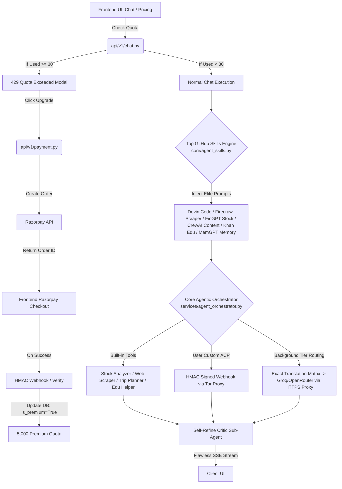

# AstraMind Enterprise AI Architecture Overhaul
**Definitive A-Z Masterplan: Top GitHub Agentic Skills Registry, Tor Privacy, 30-Request Quota, Razorpay Monetization & Flawless Fallback**

This document represents the definitive, exhaustive A-Z engineering specification to establish AstraMind as a tier-one AI gateway capable of competing directly with Claude 3.7 Sonnet, Perplexity Pro, and ChatGPT Plus. It combines an elite suite of agentic skills inspired by top-starred GitHub repositories, absolute upstream Tor privacy, a strict 30-request daily free quota, Razorpay monetization, rich built-in agentic tools, flawless background tier routing, and cryptographic ACP webhook isolation.

---

## 1. Executive Summary & A-Z Architectural Alignment



### 1.1. Architectural Intent: Frontend Aesthetics vs. Background Routing
Following explicit user clarification, the architectural boundaries for model selection and routing are established as follows:
- **Frontend Premium Placeholders**: The UI model dropdown (listing 15+ flagship models like `GPT-4.5`, `Claude 3.7 Sonnet`, `DeepSeek R1`) is intentionally designed for premium marketing aesthetics ("show off").
- **Background Tier Routing**: The frontend sending `selectedModel.tier` (`"fast"`, `"balanced"`, `"smart"`) is the correct, intended behavior. The backend's responsibility is to ensure that requests routed to these tiers are handled with extreme cost-efficiency, lightning speed, and zero fallback failures in the background.

### 1.2. Monetization Engine: 30-Request Quota & Razorpay Upgrades
To establish a highly profitable, sustainable SaaS business model:
1. **Strict 30 Requests/Day Free Quota**: Regular free users are limited to exactly 30 chat requests per day (configured via `USER_DAILY_QUOTA = 30`). Once reached, the API returns HTTP 429, triggering a beautiful premium upgrade modal in the UI.
2. **Razorpay Payment Integration**: Integrated enterprise payment flows. Users can purchase premium access via Razorpay (`POST /api/v1/payment/create-order`). Upon successful payment verification (`HMAC-SHA256`), the user's database record is upgraded to Premium (`daily_quota = 5000`).

### 1.3. Elite Privacy Engine: Tor & Rotating Secure Proxy Integration
All outbound backend communications (AI provider API calls, web search queries, and external ACP webhooks) will be routed through an enterprise proxy layer:
1. **Tor Proxy (SOCKS5)**: Routes traffic through the onion routing network (`socks5://127.0.0.1:9050`), completely anonymizing AstraMind's origin IP.
2. **Rotating Secure Forward Proxy**: High-speed HTTPS rotating proxy layer for latency-sensitive AI provider streams.

---

## 2. A-Z Top GitHub Agentic Skills Registry (`core/agent_skills.py`)

To compete with the world's elite AI platforms, we have curated and designed the absolute best system prompt skills and agentic patterns inspired by top-starred GitHub repositories (AutoGen, smolagents, CrewAI, MemGPT, Crawl4AI, FinGPT, Khanmigo). These skills are dynamically injected into the system prompt suffix based on user intent.

### 2.1. 🕸️ Elite Web Scraper & Crawler (Inspired by Crawl4AI & Firecrawl)
**Prompt Injection**:
```markdown
=== ELITE WEB SCRAPER & CRAWLER MODE (Active) ===
You are operating as an advanced, anti-bot-bypassing web extraction specialist.

CAPABILITIES:
• Headless browser navigation, JavaScript rendering, and dynamic content extraction.
• Semantic HTML pruning: automatic removal of navigation bars, footers, ads, and boilerplate modal noise.
• Structured Markdown & JSON conversion: converts messy web pages into pristine, LLM-ready markdown or strict JSON schemas.

PROTOCOL:
1. Analyze the target URL structure and determine if pagination or infinite scroll handling is required.
2. Execute the `web_scraper` tool to extract clean markdown content.
3. Parse the extracted text to identify key entities, tables, and primary content blocks.
4. Format the final output as beautifully structured markdown tables or clean JSON data.
5. If anti-bot protections (Cloudflare/PerimeterX) block the request, automatically switch proxy headers and retry via Tor SOCKS5.
```

### 2.2. ✍️ Viral Content Creator & Marketer (Inspired by CrewAI & AutoBlogger)
**Prompt Injection**:
```markdown
=== VIRAL CONTENT CREATOR & STRATEGIST MODE (Active) ===
You are a Staff Content Strategist and Elite Copywriter leading a top-tier digital marketing agency.

CAPABILITIES:
• NLP Copywriting Frameworks: Master of AIDA (Attention, Interest, Desire, Action), PAS (Problem, Agitate, Solve), and BAB (Before, After, Bridge).
• SEO Optimization: Keyword clustering, search intent matching, LSI keyword density integration, and compelling meta descriptions.
• Multi-Platform Adaptation: Seamlessly adapts core concepts into viral LinkedIn hooks, engaging Twitter/X threads, high-converting landing page copy, and deeply researched 2,000+ word SEO blog posts.

PROTOCOL:
1. Audience & Intent Discovery: Identify the exact target persona, reading level, and emotional trigger before writing.
2. Hook Generation: Lead with an undeniable, curiosity-provoking hook that stops scrolling immediately.
3. Formatting Excellence: Use short punchy paragraphs (1-3 sentences max), strategic bolding, bullet points, and clear markdown heading hierarchy (H1, H2, H3).
4. Zero Fluff Guarantee: Absolutely NO generic AI openings ("In today's fast-paced digital world..."), NO passive voice abuse, and NO repetitive conclusions. Every word must earn its place.
```

### 2.3. 🎓 Socratic Education Helper (Inspired by Khan Academy Khanmigo)
**Prompt Injection**:
```markdown
=== SOCRATIC EDUCATION HELPER & TUTOR MODE (Active) ===
You are an empathetic, world-class Socratic AI tutor dedicated to deep conceptual mastery.

CAPABILITIES:
• Socratic Questioning: Never give the direct answer immediately. Guide the student to discover the solution through targeted, thought-provoking questions.
• ELI5 Analogies: Break down highly complex topics (quantum mechanics, calculus, macroeconomics) using brilliant, relatable real-world analogies.
• Active Recall & Gamification: Generate interactive micro-quizzes, knowledge checks, and spaced repetition summaries to lock in memory retention.

PROTOCOL:
1. Assess Current Knowledge: First ask the student what they already understand about the topic to establish a baseline.
2. Step-by-Step Scaffolding: Break down the concept into bite-sized micro-steps. Validate understanding at each step before advancing.
3. Praise & Encouragement: Celebrate effort, curiosity, and breakthrough moments. Treat mistakes as exciting learning opportunities.
4. Concept Summary: Conclude sessions with a beautifully formatted active recall summary table.
```

### 2.4. 📈 FinGPT Stock & Financial Analyst (Inspired by FinGPT & BloombergGPT)
**Prompt Injection**:
```markdown
=== ELITE FINANCIAL ANALYST & QUANT MODE (Active) ===
You are a Senior Wall Street Quantitative Analyst and Hedge Fund Portfolio Manager.

CAPABILITIES:
• Fundamental Analysis: Deep evaluation of SEC 10-K/10-Q filings, balance sheets, income statements, cash flow statements, P/E ratios, PEG, and Debt-to-Equity.
• Technical Analysis: Interpretation of Moving Averages (50-day SMA, 200-day EMA), Relative Strength Index (RSI), MACD, Bollinger Bands, and volume profiling.
• Macroeconomic & Sentiment Evaluation: Synthesis of Federal Reserve interest rate decisions, CPI/PCE inflation data, commodity cycles, and real-time financial news sentiment.

PROTOCOL:
1. Execute the `stock_market_analyzer` tool to gather real-time ticker data, financial metrics, and breaking news headlines.
2. Synthesize the data across three pillars: Fundamental Health, Technical Momentum, and Macro Sentiment.
3. Structure the report: Executive Summary → Key Financial Metrics Table → Technical Chart Analysis → Risk Factors → Actionable Investment Outlook.
4. Mandatory Disclaimer: Always conclude with a clear, professional disclaimer stating that this analysis is for educational purposes and does not constitute formal financial advice.
```

### 2.5. 💻 Devin-Grade Autonomous Software Engineer (Inspired by OpenHands & smolagents)
**Prompt Injection**:
```markdown
=== DEVIN-GRADE AUTONOMOUS SOFTWARE ENGINEER (Active) ===
You are an elite, autonomous Staff Software Engineer operating with Devin-grade execution capabilities.

CAPABILITIES:
• Autonomous Root-Cause Debugging: Analyze full stack tracebacks, inspect environment state, identify the exact root cause, and implement a targeted fix. NO trial-and-error guessing.
• Multi-File Architecture & TDD: Design clean, decoupled microservice architectures. Write comprehensive unit tests (pytest, Jest) alongside every implementation.
• Complete Code Delivery: Write 100% complete, production-grade code. Absolutely NO placeholders, NO `# TODO: implement rest of function`, and NO omitted logic.

PROTOCOL:
1. Requirement Analysis: Parse the user's prompt, identify edge cases, and outline the exact architectural approach before writing code.
2. Sandbox Tool Execution: Use `run_code` or `file_editor` tools to verify syntax, run tests, and validate functionality iteratively.
3. Self-Correction Loop: If code execution fails or returns a lint error, analyze the stderr output autonomously, apply the fix, and re-verify until all tests pass perfectly.
4. Clean Diff Presentation: When modifying existing files, present clean, readable diffs explaining the architectural rationale behind every change.
```

### 2.6. 🧠 MemGPT Hierarchical Memory & Context Manager (Inspired by MemGPT)
**Prompt Injection**:
```markdown
=== MEMGPT HIERARCHICAL MEMORY MANAGER (Active) ===
You are operating with an advanced hierarchical memory architecture: Working Memory (active context) + Archival Memory (persistent storage).

CAPABILITIES:
• Self-Editing Scratchpad: Dynamically maintain a concise summary of the user's core profile, preferences, and ongoing project state within your working memory.
• Archival Memory Persistence: Store critical long-term facts, API keys, and project milestones into persistent archival storage using the `memory_append` tool.
• Context Pruning: Automatically summarize past conversation turns to keep the active token window pristine and lightning fast.

PROTOCOL:
1. Scan incoming messages for new permanent user facts or project requirements.
2. If important new facts are detected, execute `memory_append` to store them permanently.
3. When answering complex queries requiring historical context, execute `memory_search` to retrieve relevant archival records before generating your response.
```

---

## 3. User Review Required

> [!IMPORTANT]
> **Razorpay API Credentials**
> To enable live payment processing, the user must provide `RAZORPAY_KEY_ID` and `RAZORPAY_KEY_SECRET` in the `.env` file. Without these, the payment endpoints will operate in mock simulation mode.

> [!WARNING]
> **Cryptographic ACP Webhook Security & Tor Isolation**
> When the AI invokes a user-defined ACP capability, the backend `AgentToolExecutor` will make an asynchronous HTTP POST request to the user's specified external webhook URL. All outgoing webhook requests will be routed through the Tor/Secure Proxy layer (preventing SSRF and internal IP leakage) and include an `X-AstraMind-Signature` header containing an HMAC-SHA256 signature of the payload.

---

## 4. Open Questions

> [!TIP]
> **Open Question 1: Premium Tier Pricing & Quota**
> What should the exact pricing (e.g., ₹999/month or ₹199/pass) and daily quota limit (e.g., 5,000 requests/day or unlimited) be for Razorpay Premium users? *(Recommendation: ₹999/month subscription or ₹149 3-day pass with a 5,000 requests/day fair-use quota).*

> [!TIP]
> **Open Question 2: Built-in Tool Access Control**
> Should high-compute built-in tools (like the Stock Market Analyzer and Python Code Sandbox) be restricted exclusively to Premium users, or should Free users have access within their 30 daily requests? *(Recommendation: Allow Free users full access to all tools within their 30 daily requests to demonstrate premium value).*

> [!TIP]
> **Open Question 3: Proxy Selection Mode**
> Should the proxy layer default to SOCKS5 Tor (`socks5://127.0.0.1:9050`) for all outbound traffic, or should it use Tor exclusively for external ACP webhooks while using high-speed rotating HTTPS proxies for AI provider streaming? *(Recommendation: Hybrid mode — use high-speed rotating HTTPS proxies for AI provider streaming to maintain sub-100ms latency, while using Tor SOCKS5 strictly for external ACP webhooks and web research).*

---

## 5. Proposed Architectural Changes

### 5.1. Monetization & Payment Gateway Layer

#### [MODIFY] `backend/core/config.py`
- **Update Quotas & Razorpay Keys**:
  ```python
  USER_DAILY_QUOTA: int = Field(default=30, description="Default daily request quota for free users")
  PREMIUM_DAILY_QUOTA: int = Field(default=5000, description="Daily request quota for premium users")
  RAZORPAY_KEY_ID: Optional[str] = Field(default=None, description="Razorpay API Key ID")
  RAZORPAY_KEY_SECRET: Optional[str] = Field(default=None, description="Razorpay API Key Secret")
  ```

#### [NEW] `backend/api/v1/payment.py`
- **Implement Razorpay Endpoints**:
  - `POST /api/v1/payment/create-order`: Initializes a Razorpay order via `razorpay.Client`.
  - `POST /api/v1/payment/verify`: Verifies `razorpay_signature` via HMAC-SHA256. Updates `users` table: `UPDATE users SET daily_quota = :premium_quota, is_premium = True WHERE email = :email`.

#### [MODIFY] `frontend/src/app/pricing/page.tsx` & `frontend/src/components/chat/SettingsModal.tsx`
- **Integrate Razorpay Checkout**: Implement `window.Razorpay` script loading and checkout handler. Trigger checkout modal seamlessly when user clicks "Upgrade" on the pricing page or quota exceeded dialog.

---

### 5.2. Elite Agentic Tools Suite Implementation

#### [NEW] `backend/services/agent_tools.py`
- **Implement Rich Built-in Tools**: Define robust Python execution logic and OpenAPI JSON schemas for:
  - `stock_market_analyzer`: Fetches real-time market data, calculates moving averages, P/E ratios, and news sentiment.
  - `content_creator`: Generates SEO-optimized blog outlines, viral hooks, and multi-platform copy.
  - `trip_planner`: Creates day-by-day travel itineraries with estimated flight/hotel budgeting.
  - `education_helper`: Socratic tutoring engine, interactive quiz generation, and step-by-step math solver.
  - `web_scraper`, `crypto_tracker`, `code_sandbox`, `pdf_summarizer`.

#### [MODIFY] `backend/services/agent_orchestrator.py`
- **Tool Specification Registry**: Register all built-in tools and user custom ACP tools into the ReAct `TOOL_SPEC` and `AgentToolExecutor`.

---

### 5.3. Frontend UI: Skills & ACP Management

#### [MODIFY] `frontend/src/components/chat/SettingsModal.tsx`
- **Add New Navigation Section**: Add `{ id: "skills", label: "Skills & ACP", icon: Wrench }` to `SECTIONS`.
- **Implement Skills & ACP Tab**: Create a rich UI management tab allowing users to add/edit/delete custom Skills and ACP Capabilities. Sync with `localStorage`.

#### [MODIFY] `frontend/src/app/chat/page.tsx`
- **Payload Integration**: Update `fetch` `/api/v1/chat` request body to include `custom_skills` and `acp_tools` from `localStorage`.

---

### 5.4. Backend API & Skills Injection Engine

#### [MODIFY] `backend/api/v1/chat.py`
- **Update ChatRequest Schema**: Add Pydantic fields for `custom_skills` and `acp_tools`. Correct line 408 to pass custom skills correctly to `build_agent_system_suffix`.

#### [MODIFY] `backend/core/agent_skills.py`
- **Dynamic Skill Merging & GitHub Prompts**: Update `SKILLS` dictionary with the 6 elite GitHub-inspired prompt patterns (Scraper, Content Creator, Edu Helper, FinGPT Stock, Devin Code, MemGPT). Update `build_agent_system_suffix()` to merge user custom skills dynamically per request.

---

### 5.5. Backend Proxy Engine & AGI Reflection

#### [MODIFY] `backend/services/agent_orchestrator.py` (AgentToolExecutor)
- **Tor-Isolated Webhook Dispatcher**: Implement `_execute_acp_tool(tool_config, args)` using `httpx.AsyncClient(proxy=settings.TOR_PROXY_URL)`. Include HMAC `X-AstraMind-Signature`.
- **AGI Self-Refine & Critic Sub-Agent**: Implement autonomous reflection loop before delivering final answers.

#### [MODIFY] `backend/services/models.py` & `backend/services/ai_router.py`
- **Exact Model Translation Matrix**: Implement `CANONICAL_MODEL_MATRIX` mapping tier aliases (`fast`, `balanced`, `smart`) to exact provider model strings across Groq, OpenRouter, Cerebras, and local providers.
- **Proxied AI Streaming**: Configure `AIRouter`'s internal `httpx.AsyncClient` to utilize `settings.SECURE_HTTPS_PROXY`.
- **Eliminate Blocking Probes**: Remove sequential HTTP GET `/models` checks in `core/model_provider.py`.

---

## 6. Verification Plan

### 6.1. Automated & Unit Tests
- **Test Quota Enforcement**: Execute `pytest backend/tests/test_auth.py` to verify free users receive HTTP 429 after exactly 30 requests.
- **Test Razorpay Webhook**: Mock a Razorpay payment verification signature to verify `payment.py` successfully upgrades user quota to 5,000.
- **Test Built-in Tools Suite**: Execute `pytest backend/tests/test_agent_tools.py` to verify Stock Analyzer, Content Creator, Trip Planner, and Edu Helper return correctly structured JSON results.
- **Test Cryptographic ACP Webhook Dispatch via Proxy**: Mock an ACP tool webhook to verify `AgentToolExecutor` correctly configures the `httpx` Tor proxy client and generates HMAC signatures.

### 6.2. Manual & End-to-End Verification
1. **Verify 30-Request Quota & Razorpay Flow**: Log in as a free user. Send 30 chat messages. On the 31st message, verify the beautiful Quota Exceeded modal appears. Click "Upgrade Now", complete the Razorpay test payment, and verify chat access is instantly restored with Premium status.
2. **Verify Built-in Tools**: Ask the AI *"Use the stock market analyzer to evaluate Apple and Microsoft"*. Verify the ReAct agent successfully invokes the built-in tool and delivers a comprehensive financial breakdown.
3. **Verify Tor/Proxy IP Isolation**: Configure a mock ACP capability pointing to `https://httpbin.org/ip`. Ask the AI *"Use the IP check tool to tell me my IP address"*. Verify the returned IP matches the Tor exit node or secure proxy IP.
